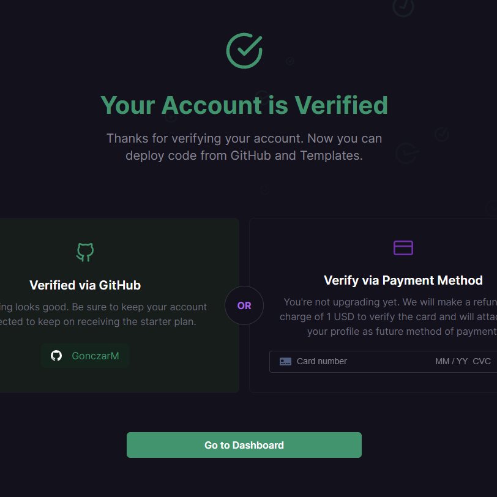
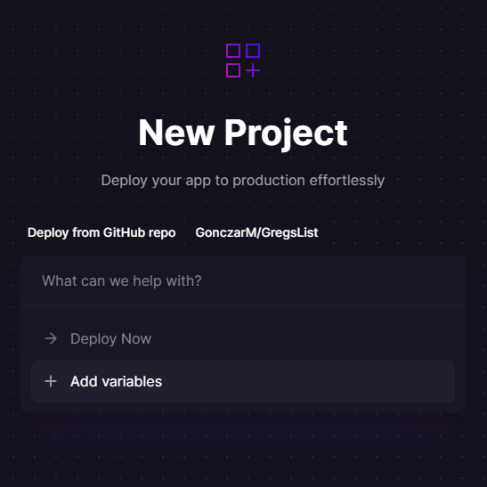
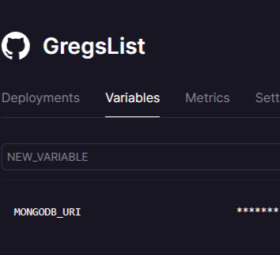

# Getting Started with Railway
<p align="center"></p>


## Lesson Details
- **Duration:** 60 Minutes
- **Significance:** Railway allows developers to host their applications in the cloud rather than locally on their computers.
- **Prior Concepts:** Students should have previous experience deploying to GitHub pages and building a full-stack app.
- **Objectives:** After this lesson students will be able to: 
    1. Deploy a full-stack app to Railway


## Background
Previously we've hosted our apps on GitHub Pages. GitHub pages is a great tool for hosting static sites - basic HTML, JS, and CSS websites. We need a more robust tool to host a back-end, a front-end, and that can run our node packages. Railway is one such hosting platform that we can host a full-stack app for free.

Below are steps to walk you through deploying a full-stack app on Railway.


### 1. Sign Up with a Railway Account
1. Navigate over to [Railway's website](https://railway.app/)
1. Click on Start a New Project

    
1. On the next page select Deploy from GitHub repo and login to github
    
    
    
    - You will then be prompted to enter in your personal github username and password.
    - Once that is complete you will be redirected back to the New Project page.
    - Click Deploy from Github repo again.
1. You then will be prompted to verify your account.
    
    
    
    - Accept the Terms of Service and agree with Railway's Terms of Service
    
    
    
    - Review the Fair use Policy and proceed
    
    

    - Now that you are verified you can continue to your dashboard

    


### 2. Deploy A Full-stack App
1. Now click the Create a New Project or New Project button
    
    
1. Again Deploy from GitHub repo, now choose the repo you wish to deploy
    
    
1. Before we deploy we need to add our MONGODB URI variable as well as our google OAuth variables
    
    
    
    - Make sure your key matches your .env file. Your value will be your mongoDB Atlas URI connection string.
        EX:
        ```bash
        MONGODBURI=mongodb+srv://<username>:<password>@cluster0.chzvu3c.mongodb.net/<nameOfDB>?retryWrites=true&w=majority
        ```
    
    
    
1. Make sure you change your callback url to reflect the production url NOT LOCALHOST 

1. You will also need to add a new authorized redirect URI on Googles Cloud API service for the People API

1. Once that is complete you can navigate to the Deployments tab to finish the deployment and click view logs.
    
    
    
    - Once you see your app listener and mongoose connect console logs your app is fully deployed.
    
    

1. Navigate to the Settings tab and click Generate Domain.
    
    
1. Once that is complete you can click on the link and view your deployed site!
    
    
