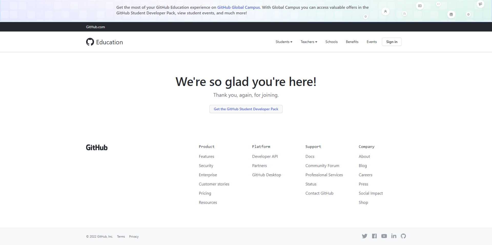
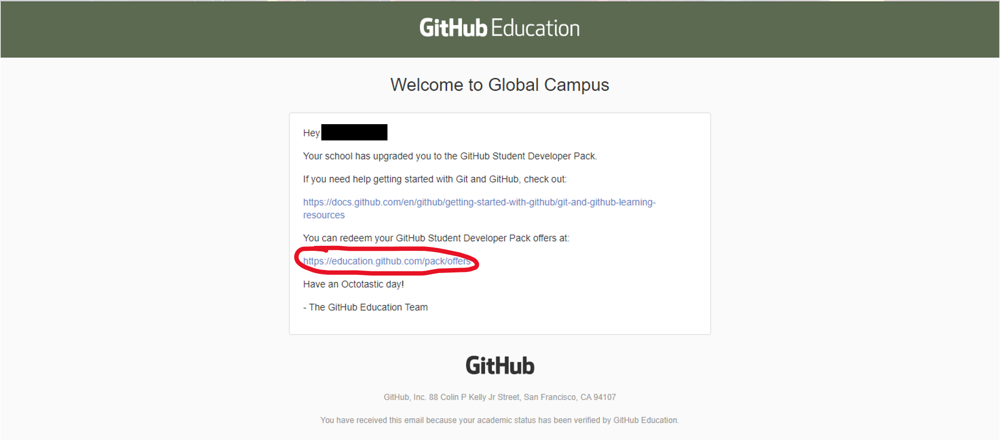
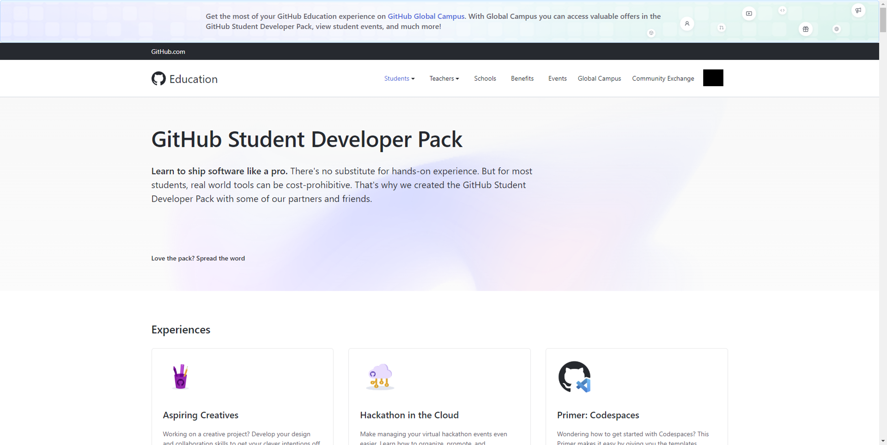

# Getting Started with GitHub Campus

## Lesson Details
- **Duration:** 15 Minutes
- **Significance:** You can use the Global Campus portal to connect with a community of students and industry experts, find access to industry tools, learn about new events, and see any assigned GitHub classroom coursework all in one place.
- **Objectives:** After this lesson students will be able to: 
    1. Register for GitHub Campus
    1. Access their GitHub Student Developer Pack

## What is GitHub Campus?
From the [GitHub blog](https://github.blog/2021-09-01-introducing-github-global-campus/):
<blockquote cite="https://github.blog/2021-09-01-introducing-github-global-campus/">
    
Global Campus allows students to more easily take advantage of GitHub Education offerings. Its provides students with the ability to:
        <ul>
            <li><strong>Connect with a local Campus Expert.</strong> Leverage the collective knowledge of the GitHub student community so you can develop the skills needed for future careers in tech.</li>
            <li><strong>Explore and claim offers for free industry tools in the Student Developer Pack.</strong> This now includes 100+ offers—everything from free credits to waived fees.</li>
            <li><strong>Attend events curated by our Campus Experts and students who broadcast on Campus TV, our Education Twitch channel.</strong> Discover in-person and virtual events ranging from local hackathons to online tech talks covering everything from DevRel and cybersecurity to sharpening skill sets for post-graduation.</li>
            <li><strong>Review teacher-assigned due dates for GitHub Classroom assignments.</strong> You can also leverage the Visual Studio Code Classroom extension to complete assignments, as well as collaborate with peers and teachers to get unblocked.</li>
            <li><strong>Rewatch recent Campus TV episodes.</strong> Created by GitHub and student community leaders, which can be watched live for community chat and involvement or video-on-demand (VOD) for total schedule flexibility.</li>
        </ul>
    

</blockquote>

## Get Set Up with GitHub Campus
### Step 1: Log In to GitHub
1. In your browser, if not logged in already, log into [GitHub](https://github.com) (not GitHub Enterprise) using your personal GitHub account that you provided to General Assembly.
1. By now you'll have received a unique URL that starts with `https://education.github.com/student/...`. Navigate to the the full URL you were given and you'll see a page like this:

    

1. ❗ **_DO NOT CLICK ON ANYTHING!_** ❗There is no need to click the **Get the GitHub Student Developer Pack** button. By simply entering the URL in your browser you received access to Student Developer pack immediately.

### Step 2. Check Your Email
1. Go to the email account associated with your personal GitHub account and look for an email from `edu-noreply@github.com`. Upon openign the email you should see this message:

    

1. Click the link as shown in the image above, or navigate to [https://education.github.com/pack/offers](https://education.github.com/pack/offers).

## Step 3. Access Your Student Developer Pack
1. You should now see a page that looks like this:

    

1. Go ahead and check out all the awesome offers provided to you via GitHub Campus! 🎉

    
