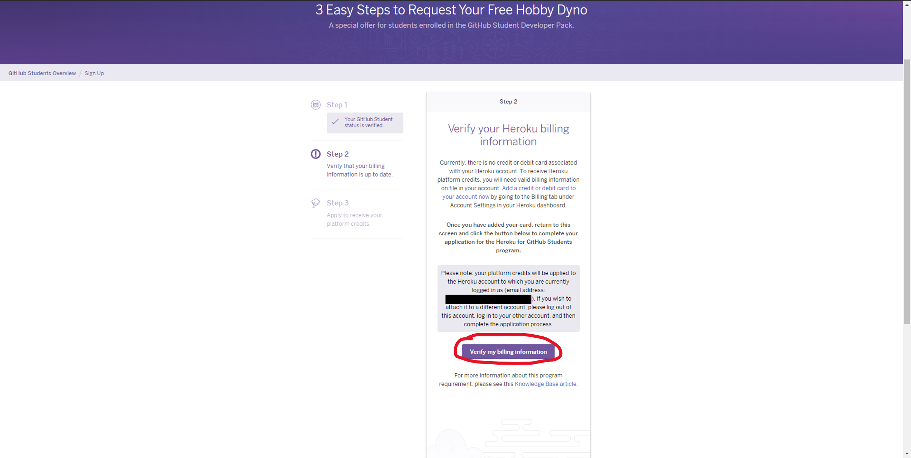
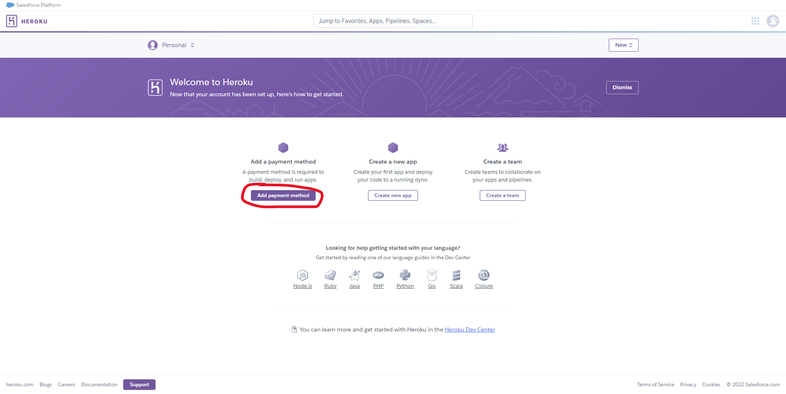
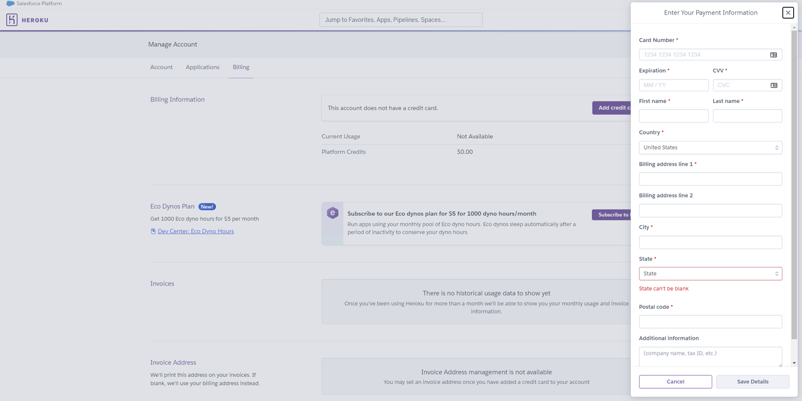

# Getting Started with Heroku
<p align="center"></p>


## Lesson Details
- **Duration:** 30 Minutes
- **Significance:** Heroku is a hosting platform with an intuitive interface and many capabilities. It gives developers a versatile and robust platform to host their web apps on AWS (Amazon Web Services) servers without the hassle of using the AWS interface.
- **Prior Concepts:** Students should have set up their GitHub Campus account, as well as have an understanding of what hosting is.
- **Objectives:** After this lesson students will be able to: 
    1. Understand what Heroku is and how it works
    1. Register for a Heroku account via GitHub Campus
    1. Install the Heroku CLI


## Background: Heroku & AWS
We know now that in order to make our applications available to the public, we have to store them on an internet server. There are many cloud infrastructure proivders that allow developers to use the provider's servers to deploy web apps. Some of the more popular cloud infrastructure proivders are AWS and Heroku.

<table align="center">
    <tr>
        <th align="center" width="500px">
            
        </th>
        <td>
            Amazon Web Services (AWS) is the <a href="https://www.statista.com/chart/18819/worldwide-market-share-of-leading-cloud-infrastructure-service-providers/">largest cloud infrastructure provider in the world</a>. AWS hosts millions of websites and applications on their servers, and gives developers hundreds of services & features to choose from. 
            <br/><br/>
            The learning curve for AWS is intense, and AWS actually has many <a href="https://aws.amazon.com/certification/">certification courses</a> developers can take. These courses allow developers to learn and then prove to employers that they are capable of navigating and using the extensive platform.
        </td>
    </tr>
    <tr>
        <th align="center" width="500px">
            
        </th>
        <td>
            Heroku is another hosting platform, but doesn't own any physical servers like Amazon. Heroku actually utilizes Amazon servers but providers developers with a much simpler and intuitive front-end to faciliate the deployment process. 
            <br/><br/>
            Although the interface is simpler, developers can still host large and powerful web apps using Heroku while having access to many useful features.
        </td>
    </tr>
</table>


## Set up a Heroku Account with GitHub Campus
GitHub has partnered with Heroku to give GitHub Students free credits to use Heroku's services. To access these credits, you must set up a Heroku Account using GitHub Campus. To set up your Heroku Account using GitHub Campus, expand out the walkthrough below.

<details>
    <summary><strong>Walkthrough: Register for a Heroku Account</strong></summary>

### Step 1: Access Your Student Developer Pack
1. Ensure that you are logged into your personal [GitHub](https://github.com) account (not GitHub Enterprise) that you provided to General Assembly.
1. Ensure that you have registered for GitHub Campus with your personal GitHub account. If you have not yet registered for GitHub Campus, follow [this walkthrough](./1.%20GitHub%20Campus%20Registration.md).
1. Navigate to [https://education.github.com/pack/offers](https://education.github.com/pack/offers).
1. You should now see a page that looks like this:

    

1. Scroll down the page until you see the Heroku card, and then click on the card.

    

1. You'll be taken to a page like the one shown below. Click on the *Get the student offer* button.

    


### Step 2: Sign Up for a Heroku Account
1. You'll now see one of two pages shown below. 
    1. If you see Login Page A, click on the *Login with Heroku* button to be taken to Login Page B. 
    1. If you see Login Page B, click the *Sign Up* button to register for an account.
    <table align="center">
    <tr>
    <th align="center" width="500px">Login Page A</th>
    <th align="center">Login Page B</th>
    </tr>
    <tr>
    <td></td>
    <td></td>
    </tr>
    </table>

1. After clicking *Sign Up* you'll be taken to a form. Fill it out and then click *Create Account*.

    

1. A new page will appear indicating that an email was sent to the email you provided in the form.

    

1. Go to your email and look for the confirmation message sent by `noreply@heroku.com`. The message should be similar to what you see in the image below. Click on the link to activate your account.

    

1. The email will open a new Heroku tab in your browser. You can now close out of the previous tab (the page shown in step 2-3). In the new tab, you're prompted to create a password. Once you create your password click the *set password and log in* button.

    

1. On the next page, click the *proceed* button to continue setting up your account.

    


### Step 3: Verify Your Student Status
1. You'll now be taken to the application menu. You'll return here several times. On this page you must first click *Verify with GitHub* to link your personal GitHub account (now registered with GitHub Campus) with Heroku.

    

1. The standard GitHub authorization page will appear. Click *Authorize heroku* to link your accounts. This will verify you are a student and allow you to deploy projects directly from your GitHub repositories.

    


### Step 4: Verify Your Billing Information
1.  You'll now be taken back to the application menu to verify your billing information.
1. ❗***YOU HAVE FREE CREDITS WORTH $13 USD PER MONTH FOR 12 MONTHS. YOU WON'T BE CHARGED UNLESS YOU EXCEED YOUR CREDITS***❗
1. Verfifying your billing information ensures that:
    - You are a real person
    - Heroku can charge you if you exceed your credits. 
        - Heroku will also email you reminders as your credits get closer to running out.
    
    Click on *Verify my billing information* to continue.

    

1. A new page detailing the Terms of Service will appear. Read and accept the terms.

    

1. You'll get directed to your personal Heroku dashboard. We'll visit this again later. For now, select *Add payment method*.

    

1. You'll find yourself at the Account management page where you can configure your account settings. For now, select *Add credit card*.

    

1. A sidebar will pop out on the left of your screen. Fill out the form and then click *Save details*.

    

1. The sidebar will close and you'll now see your credit card information has been applied to your account.

    


### Step 5: Finish the Application for Free Heroku Credits
1. Return to the application menu. Fill out the form and then click send to finish applying for free Heroku credits.

    

1. More Terms of Service will appear in a modal. Read and accept the terms.

    

1. Your application menu will now have every step completed. It may take 24+ hours to approve the application. You'll receive an email once your aplication is approved.

    

1. You can now return to your [Heroku dashboard](https://dashboard.heroku.com/) if you wish. You can use this dasboard to deploy apps once your credits are approved. Additionally, there's a [CLI (command line interface) tool](https://devcenter.heroku.com/articles/heroku-cli) you can install to deploy apps from your terminal.

    
</details>


## The Heroku CLI
As mentioned in the last step of the walkthrough above, Heroku has a powerful CLI (Command Line Interface) tool you can use. Using just your terminal, you can deploy and configure your apps. Additionally, the CLI allows you to access the file system of the [dyno](https://devcenter.heroku.com/articles/dynos) on which your app is hosted.
> A dyno is Heroku's version of a [virtual machine](https://www.vmware.com/topics/glossary/content/virtual-machine.html) (virtual computer) that acts as the server for your app.

To install the Heroku CLI on macOS, expand out the walkthrough below. For any other OS, follow [Heroku's installation guide](https://devcenter.heroku.com/articles/heroku-cli#install-the-heroku-cli).


<details>
    <summary><strong>Walkthrough: Install Heroku CLI on macOS</strong></summary>

1. In your terminal run the following command:
    ```bash
    brew tap heroku/brew && brew install heroku
    ```
    The Heroku CLI should now be installed!

1. To verify the installation was successful run:
    ```bash
    heroku --version
    ```
    You'll get an output indicating which version was installed. It will be similar to this:
    ```
    heroku/7.53.0 <OS VERSION HERE> <NODE VERSION HERE>
    ```

1. To login into your Heroku account from the CLI run:
    ```bash
    heroku login
    ```
    This will open up a browser window for you to sign into Heroku and connect the CLI to your account.
</details>


## References
- [TrifinLabs.com: What is Heroku?](https://trifinlabs.com/what-is-heroku/)
- [aws.amazon.com: What is Cloud Computing](https://aws.amazon.com/what-is-cloud-computing/)
- [Heroku.com: Heroku for GitHub Students](https://www.heroku.com/github-students/)
- [Heroku.com: The Heroku CLI](https://devcenter.heroku.com/articles/heroku-cli)
